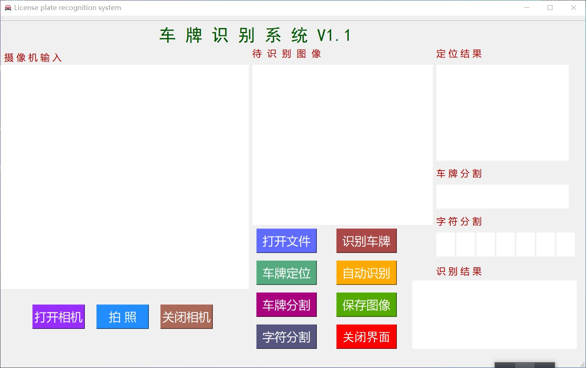
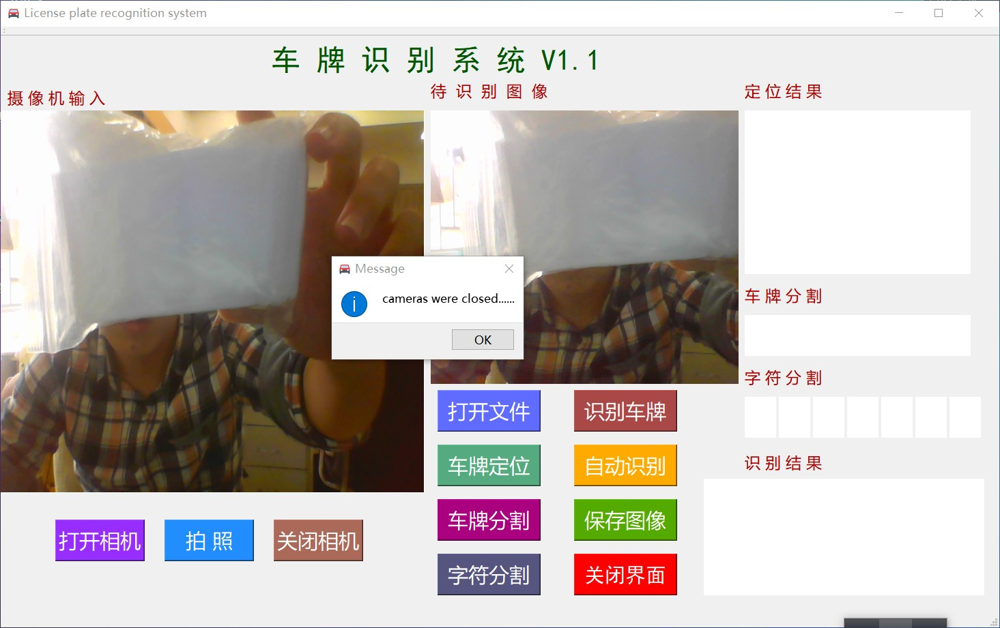
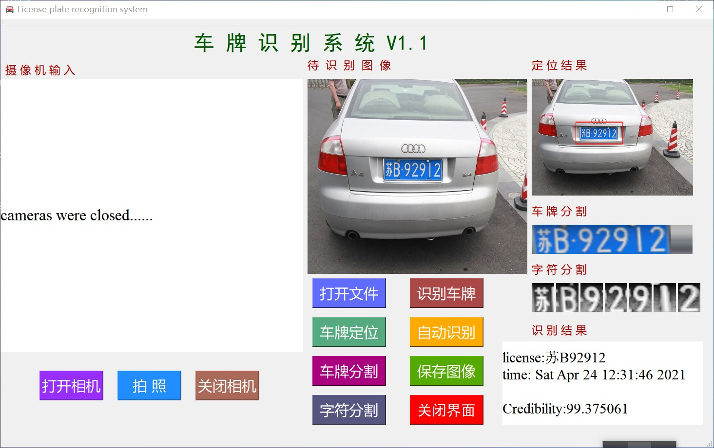

# License plate recognition system

- License plate recognition system based on VS2015+QT
- License plate positioning: adopting an improved geometric positioning method, firstly realize rough positioning through edge detection, and then realize precise positioning according to the fixed features of the license plate area
- Character segmentation: Use OpenCV to find the segmentation rectangle of the character, locate the edge contour of the character, and realize the character segmentation
- Character recognition: refer to the HyperLPR project and use its trained character recognition network
- Adopts C++ language and is jointly developed by VisualStudio2015 and QtCreator, and the recognition accuracy is about 93%

### user-interface

### Camera test

### Image test

### About me

If you have any questions, please contact me by email [1765904103@qq.com]

